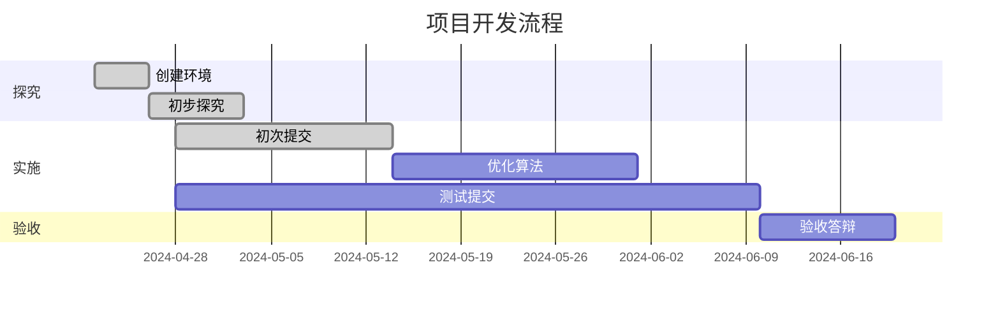

# BirdCLEF2024 🐦
## 任务日志  

* 建立仓库，团队加入

* 加入比赛  
  研究比赛规则、任务

* 研究比赛数据  
  完成train_metadata分析及可视化  
  完成音频数据可视化

* Kaggle运行BirdCLEF24: KerasCV Starter

* 合并pre分支，把参考文献文件夹合并过来了，感觉可以删掉pre，不用分支  
  添加了BirdCLEF24 KerasCV Starter的代码解释文件，作为研究参考  
  添加someidea.md，改进想法

* 5.19更新更新🀄  
  添加compare.md，2023年和已上传的对比

* 5.26        
  通过添加Dropout层,解决原模型存在的过拟合问题,详细更新在someidea.md          
  将mixup函数部分从全部进行改为以0.5的概率进行
                        
* 5.27                    
  加入了WandB部分可以实现共享文件，（具体可以看下你们是否可以看到我的版本）         
  加入之前几年的input以及对前几年数据进行处理               

* 6.3  
  effnet+fsr+cutmixup用以往数据做预训练24年数据训练，但存在问题（6.4问题解决）

* 6.4🔥  
  forkbirdclef，0.65  
  还有段段那个也是0.65  
  （这个只用了24年的数据，可以往里面加以往数据做预训练？但是这样就得拆成两个notebook）
  effnet+fsr+cutmixup+pre-training用以往数据做预训练/2024数据训练
  

## 0 一些资料
### 0.1  GitHub Desktop

【b站视频】 https://www.bilibili.com/video/BV1o7411U7j6/?share_source=copy_web&vd_source=62d3967069c1f835b2792b2c6bc29ce3

【使用文档】https://cnxfs.com.cn/download/GithubIntroductionForMembers.docx

### 0.2  小玩意  
Gitm👽️ji  
https://gitmoji.dev/

Unicode 符号表  
https://symbl.cc/cn/unicode-table/#miscellaneous-symbols-and-pictographs

em🙂ji  
https://www.webfx.com/tools/emoji-cheat-sheet/

### 0.3 参考文献概览

预训练音频神经网络  
PANNs Large-Scale Pretrained Audio Neural Networks for Audio Pattern Recognition

## 1 BirdCLEF24: KerasCV Starter
### 1.1 研究代码
code explanation.md  
得分0.60，暂以此作为baseline

### 1.2 算法改进
someidea.md  
compare.md

## 2 EffNet + FSR + CutMixUp  
### 2.1 预训练  
加入2020，2021，2022，2023年数据作为预训练，2024年数据训练（0.61）  
模型保存在https://www.kaggle.com/datasets/wengsilu/birdclef2024training

### 2.2.1 新模型  
BirdCLEF 2024:Species Identification from Audio（0.65）

### 2.2.2 加入新模型
加入新模型，分别预测结果，将预测结果取平均提交（0.66，97/917）

## 项目开发流程

