# BirdCLEF2024 🐦
## 任务日志  

* 建立仓库，团队加入

* 加入比赛  
  研究比赛规则、任务

* 研究比赛数据  
  完成train_metadata分析及可视化  
  完成音频数据可视化

* Kaggle运行BirdCLEF24: KerasCV Starter

* 合并pre分支，把参考文献文件夹合并过来了，感觉可以删掉pre，不用分支  
  添加了BirdCLEF24 KerasCV Starter的代码解释文件，作为研究参考  
  添加someidea.md，改进想法

* 5.19更新更新🀄  
  添加compare.md，2023年和已上传的对比

* 5.26
  通过添加Dropout层,解决原模型存在的过拟合问题

## 0 一些资料
### 0.1  GitHub Desktop

【b站视频】 https://www.bilibili.com/video/BV1o7411U7j6/?share_source=copy_web&vd_source=62d3967069c1f835b2792b2c6bc29ce3

【使用文档】https://cnxfs.com.cn/download/GithubIntroductionForMembers.docx

### 0.2  小玩意  
Gitm👽️ji  
https://gitmoji.dev/

Unicode 符号表  
https://symbl.cc/cn/unicode-table/#miscellaneous-symbols-and-pictographs

em🙂ji  
https://www.webfx.com/tools/emoji-cheat-sheet/

### 0.3 参考文献概览

预训练音频神经网络  
PANNs Large-Scale Pretrained Audio Neural Networks for Audio Pattern Recognition

## 1 BirdCLEF24: KerasCV Starter
### 1.1 研究代码
code explanation.md  
得分0.60，暂以此作为baseline

### 1.2 算法改进
someidea.md  
compare.md

## 项目开发流程

```mermaid
gantt
    title 项目开发流程
    todayMarker off
    section 探究
      创建环境           :done, 2024-04-22, 4d
      初步探究     :done, 2024-04-26, 7d
   
    section 实施
      初次提交      :done, 2024-04-28  , 16d
      优化算法      :2024-05-14  , 18d
      测试提交      :2024-04-28  , 43d

    section 验收
      验收答辩    :2024-06-10, 10d
```

